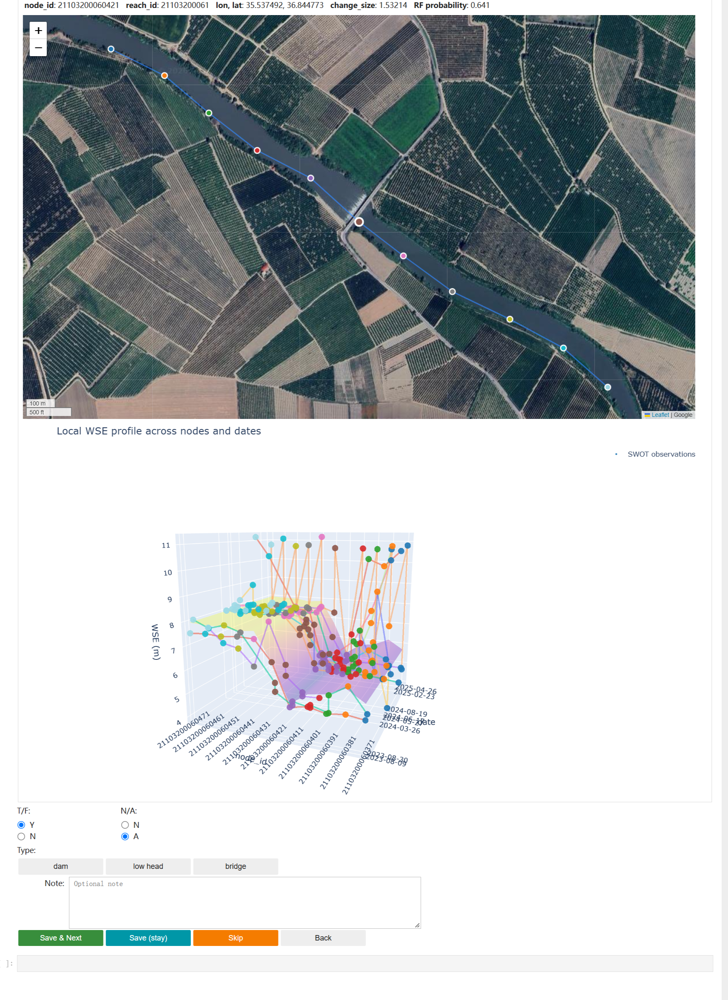

# SWOT_RiverSP_Obstruction
## Overview
This repository is the preprocessing and detection workflow used to identify potential river discontinuities from SWOT RiverSP observations.

The workflow processes the original SWOT RiverSP node products and applies a step-change detection algorithm to identify abrupt changes in water surface elevation (WSE) along river reaches. These discontinuities may indicate the presence of hydraulic controls such as dams, weirs, or other anthropogenic or natural obstructions.

To support reproducibility while reducing data size, the repository includes both:
- the **full workflow** (requiring external datasets), and  
- a **lightweight demo pipeline** that can be run directly.


## Repository Structure
```text
scripts/
├── 01_preprocess
│   ├── 01_nodePre.py # Extract variables from SWOT RiverSP node shapefile archives
│   └── 02_DataPre.ipynb # Prepare analysis-ready datasets
│
└── 02_detection
    ├── 01_SWOOP.ipynb # SWOOP detection workflow
    ├── 02_SWOOP_demo.ipynb # Reproducible demo of SWOOP pipeline
    └── 03_SWOOP_demo_interactive.ipynb # Interactive annotation of demo test candidates
```

## Data File Structure

The workflow uses the following data directory structure:

```text
data/
├── demo_data/ # Small reproducible demo datasets (included)
│   ├── demo_node_train_valid_raw.csv
│   ├── demo_node_sigma0_v5.10.csv
│   ├── demo_node_occu_mean.csv
│   ├── demo_train_valid_candidates.csv
│   ├── demo_train_valid_candidates_annotated.csv
│   ├── demo_train_valid_candidates_annotated_withcc.csv
│   │
│   ├── demo_eu_test_raw.csv
│   ├── demo_eu_test_sigma0.csv
│   ├── demo_eu_test_occu.csv
│   ├── demo_eu_test_step_candidates.csv
│   ├── demo_eu_test_step_candidates_with_cc.csv
│   ├── demo_eu_test_rf_predictions.csv # Candidate features and RF predictions used for review
│   ├── demo_eu_test_node_geometry.csv # Included node_id/lon/lat lookup for demo test nodes
│   ├── demo_eu_test_candidates_interactive_ANNOTATED.csv # Generated when annotations are saved
│   └── crop2.png # Interactive annotation screenshot
│
├── raw/ # Original SWOT data files downloaded from NASA Earthdata
│   └── RiverSP_VC/
│       └── SWOT_L2_HR_RiverSP_Node_*.zip
│
├── derived_raw/ # Intermediate datasets generated from initial preprocessing of raw data
│   ├── RiverSP_VC_daily/
│   │   └── node_YYYYMMDD.csv
│   │
│   ├── continent/
│   │   └── node_{af,eu,si,as,au,sa,na,ar,gr}_noice.csv
│   │
│   ├── continent_filtered/
│   │   └── node_{af,eu,si,as,au,sa,na,ar,gr}_v5.csv
│   │
│   ├── continent_valid_dates/
│   │   └── node_{af,eu,si,as,au,sa,na,ar,gr}_v5.10.csv
│   │
│   ├── node_geometry/
│   │   └── node_geometry.csv
│   │
│   └── gsw_tiles/
│       └── occurrence-*.tif
│
├── input_data/ # Analysis-ready datasets used as inputs for detection algorithms 
│   ├── node_train_valid_v5.10.csv
│   ├── node_{af,eu,si,as,au,sa,na,ar,gr}_test_v5.10.csv
│   ├── node_sigma0_v5.10.csv
│   └── node_occu_mean.csv
│
└── results/ # Detection results and annnotated datasets 
    ├── train_valid_step_candidates_v6.8.csv
    ├── train_valid_step_candidates_v6.8_ANNOTATED.csv
    ├── {af,eu,si,as,au,sa,na,ar}_test_step_candidates_v6.8.csv
    ├── test_step_candidates_v6.8.csv
    └── global_predicted_v6.8.csv
```
## Requirements

- Python 3.10+
- Required Python packages:
    - numpy>=1.24
    - pandas>=2.0
    - geopandas>=0.14
    - shapely>=2.0
    - fiona>=1.9
    - pyproj>=3.5
    - rasterio>=1.3
    - rioxarray>=0.15
    - dask>=2024.1
    - scikit-learn>=1.8
    - matplotlib (interactive annotation demo)
    - plotly (interactive annotation demo)
    - ipywidgets (interactive annotation demo)
    - folium (interactive annotation demo)

Run the interactive annotation notebook in a Jupyter environment with widget support. An internet connection is needed to load the satellite basemap.

## Script Descriptions
### 1. Raw data preprocessing (`01_preprocess/01_nodePre.py`)
Preprocesses the original SWOT Level-2 HR **RiverSP node shapefile** archives to **daily node-level CSV files** for further analysis.
### 2. Data preparation (`01_preprocess/02_DataPre.ipynb`)
Prepares **analysis-ready datasets** from the daily node data generated in the previous step.
### 3. Detection algorithm (`02_detection/01_SWOOP.ipynb`)
Implements the **SWOOP (SWOT Obstruction Profile)** workflow.
### 4. Demo Pipeline (`02_detection/02_SWOOP_demo.ipynb`)
Uses a small subset of data to run the **SWOOP** workflow.
### 5. Interactive Demo Annotation (`02_detection/03_SWOOP_demo_interactive.ipynb`)
Provides an interactive labeling interface for all **139 demo test candidates**, combining a satellite map with a local three-dimensional WSE profile across nodes and observation dates. All candidate, observation, and coordinate inputs are included in `data/demo_data/`.

## Usage
### Data Download
The preprocessing scripts in `scripts/01_preprocess/` require several large public datasets.  
All required datasets are **publicly available and can be downloaded from the original data providers**.
- SWOT RiverSP: https://search.earthdata.nasa.gov/
- GSW: https://global-surface-water.appspot.com/download

The core workflow of detection algorithm in `scripts/02_detection/` requires prepared analysis-ready datasets. To facilitate reproducibility,
demo datasets are **publicly available on this github repo**.

### Open and run (demo):

#### Step 1. Run the SWOOP detection demo (`02_SWOOP_demo.ipynb`)

Open [02_SWOOP_demo.ipynb](scripts/02_detection/02_SWOOP_demo.ipynb) in Jupyter and run its cells from top to bottom. This notebook demonstrates the detection and classification workflow using the supplied training and European test datasets in `data/demo_data/`:

1. Aggregate repeated node observations into median WSE profiles, WSE standard deviations, and mean river widths, then combine them with radar backscatter and water occurrence data.
2. Detect candidate step changes along each reach and calculate their diagnostic features for both the training and test datasets.
3. Compute local profile-correlation (CC) features by comparing daily WSE profiles with the median profile around each candidate node.
4. Train a Random Forest classifier on the supplied manually annotated training candidates and predict the probability and binary label for each test candidate.

The notebook saves candidate and CC feature tables, all test predictions in `demo_eu_test_rf_predictions.csv`, and the predicted positive subset in `demo_eu_test_rf_positive.csv`. All outputs are written to `data/demo_data/`. The all-prediction table is the input for Step 2; precomputed demo outputs are also included in the repository.

#### Step 2. Interactively annotate test candidates (`03_SWOOP_demo_interactive.ipynb`)

Open [03_SWOOP_demo_interactive.ipynb](scripts/02_detection/03_SWOOP_demo_interactive.ipynb) and run its cells from top to bottom. This notebook reviews all test candidates in `demo_eu_test_rf_predictions.csv`, using the included test observations and `demo_eu_test_node_geometry.csv` coordinates to display each case.

- Inspect the satellite map and the WSE profile for the candidate node and its neighbors.
- Select **T/F** (`Y` or `N`). Positive cases also require **N/A** (`N` = natural, `A` = artificial) and a **Type**: `waterfall` or `rapid` for natural cases; `dam`, `low head`, or `bridge` for artificial cases. Type has no `?` option. Notes are optional.
- **Save & Next** saves a complete annotation and finds the next unlabeled case. **Skip** moves to the next unlabeled case without saving the current form changes; the search wraps to the start, so skipped cases are revisited. **Save (stay)** saves the current case, and **Back** revisits the previous case.
- Annotations are saved separately as `data/demo_data/demo_eu_test_candidates_interactive_ANNOTATED.csv`, with an `_AUTOSAVE_BACKUP.csv` copy of the previous saved version.

Example of the interactive annotation interface:



### Reproducibility Notes
- The demo dataset is a small subset sampled from the full dataset
- Candidate detection logic is identical between demo and full workflow
- Differences in results are expected due to:
    - reduced data size
    - sampling variability
    - incomplete coverage of global river systems

## Citation
Yue Xu, Peirong Lin\*, et al. Uncovering Hydraulic Discontinuities in Global Rivers with SWOT (in review).  
\* Corresponding Author: Peirong Lin (peironglinlin@pku.edu.cn)  
Contacts: Yue XU (xuyue6371@pku.edu.cn)
