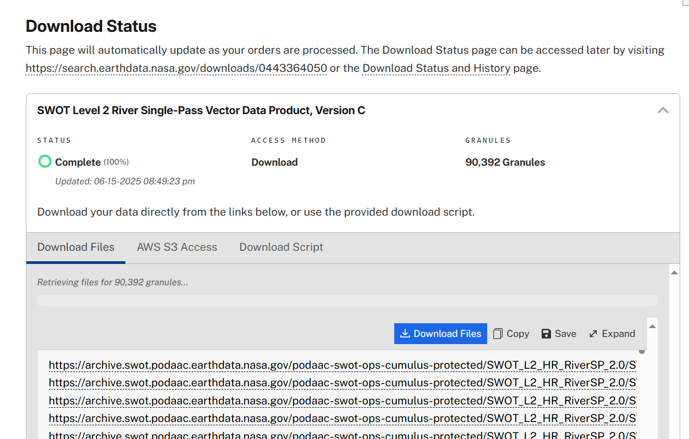

# SWOT_RiverSP_Obstruction
Repository Description: 
- Repository for processing SWOT RiverSP product and identifying potential river obstructions.

# How to download SWOT RiverSP data
1. Website: [**Earthdata**](https://search.earthdata.nasa.gov/search)
2. Search product name: **SWOT Level 2 River Single-Pass Vector Data Product, Version C**
> Note: The Version D has been released, but the data is not complete right now. Many dates are missing data.
3. Set tempral and spatial filter on website GUI.
4. With download links list like:

Download all links: using browser extension -- [**DownThemAll**](https://www.downthemall.net/)
5. Downloaded files like: *SWOT_L2_HR_RiverSP_Node_032_166_SI_20250503T222433_20250503T222608_PIC2_01.zip*

# Orginal SWOT RiverSP data -> Daily csv file
- Code:
    - [nodePre.py](./nodePre.py)
    - [reachPre.py](./reachPre.py)

# Daily csv file -> Continental csv file
- Because we will calculate the median of node, all the observations of the same node need to be collected into one dataframe.
- Storing **global** data in one dataframe poses a memory challenge, so data is partitioned by **continent**, with each continent having a separate data file.
- Code
    - [DataPre.ipynb](./DataPre.ipynb)

# Identify river obstruction: SWOOP Algorithm
- [SWOOP_v1.ipynb](./SWOOP_v1.ipynb)